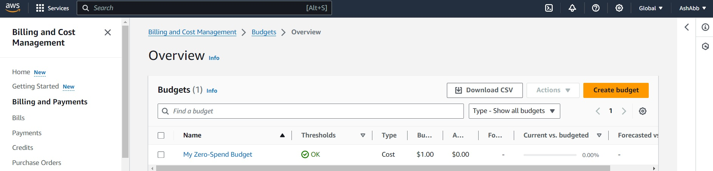

# Week 0 — Billing and Architecture
## Conceptual Archetictural Diagram

## Logical Diagram
## I created this logical diagram through Lucidchart
 or .png)
[Lucid Charts Shared Link](https://lucid.app/lucidchart/fe68fd0e-6952-45eb-9b03-0f113d338626/edit?viewport_loc=-641%2C-176%2C3517%2C1627%2C0_0&invitationId=inv_309329e2-5c96-4814-9f05-129cd182aa33)
### AWS CLI, creating a budget and billing alarm
Project included creating an admin user and AWS credentials, as well as installing AWS CLI on Gitpod.

The budget was created through AWS CLI on Gitpod based on the budget and budget notifications JSON-files on the AWS/JSON-folder. There is also a JSON file for the billing alarm. It required first a new SNS topic for which the subscription had to be confirmed via email. After that, the actual Cloudwatch alarm could be created through AWS CLI.

### Create a Budget Alarm
I created my own Budget for $1 because I was concerned of budget spending going over the 2 Budget free limit.

